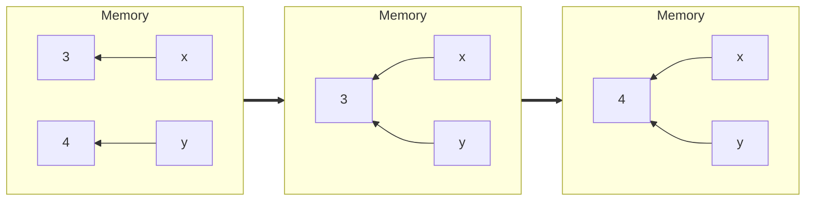

# 2. 開発環境と式

## 開発環境

本コースは、モダンで静的型付けの**マルチパラダイム**プログラミング言語であるMoonBitをベースとしています。MoonBitは初心者にも優しい軽量な構文を備えています。MoonBitについて詳しく知りたい場合は、[公式ウェブサイト](https://www.moonbitlang.com/)をご覧ください。

MoonBitの開発ツールは主に2つの部分で構成されています：VS Code拡張機能とコマンドラインツールです。

拡張機能は広く使われているエディタであるVS Codeを基盤としており、コーディング環境、言語サーバー、パッケージレベルのビルドツールを提供します。言語サーバーは、シンタックスハイライト、変数の参照と定義へのジャンプ、自動コード補完、プログラムの実行とデバッグなどの便利な機能を提供します。MoonBitにおけるパッケージは、複数のソースファイルを整理する構造です。パッケージ内では、異なるソースファイルで定義された関数が相互にアクセス可能であり、特に小規模なプロジェクトで開発者が作業しやすくなっています。

コマンドラインツールは、プロジェクトレベルの開発サポートを提供します。これにはビルド、テスト、依存関係管理が含まれます。MoonBitのプロジェクトは通常、相互に依存する複数のパッケージで構成されます。他の開発者が実装した機能を使用するために、他のパッケージをインポートすることも可能です。

後の章では、プロジェクトとパッケージについて詳しく紹介します。今のところ、パッケージレベルに焦点を当てます。

特筆すべきは、VS Codeにはインストール不要のWebベース版が用意されていることです。したがって、少なくとも3種類の開発環境がサポートされています：ブラウザベース環境（例：VS Code for the Web）、クラウドネイティブ環境（例：Coding、Gitpod、GitHub.dev）、ローカル環境です。本コースでは、いずれの環境も適しています。

### ブラウザベース環境

[try.moonbitlang.com](https://try.moonbitlang.com)にアクセスするか、[公式ウェブサイト](https://moonbitlang.com)の「Try」タブをクリックしてください。現在、この環境ではファイル作成、コード実行、共有などのさまざまな機能が提供されています。また、MoonBitを学ぶためのサンプルプログラムも用意されています。

現在、この環境ではユーザーデータ（ユーザーが作成・編集したすべてのファイルを含む）は保存されません。そのため、貴重なコードを失わないように、ローカルバックアップを作成することを強く推奨します。

### クラウドネイティブ環境

クラウドネイティブ環境は通常、リモートサーバーを基盤としています。従来のサーバーとは異なり、月額課金ではなくオンデマンドで課金されることが一般的です。

これらのサーバーはさまざまなクラウドサーバープロバイダーによって提供されています。ただし、MoonBit開発環境の一般的なセットアップ手順は同じです：リポジトリを作成またはクローンし、環境を起動し、「MoonBit Language」拡張機能をインストールします。

上級ユーザーは、[コマンドラインツール](https://www.moonbitlang.com/download/)をインストールするか、[クラウドネイティブ開発テンプレート](https://github.com/peter-jerry-ye/moonbit-template)をクローンすることも可能です。詳細なガイダンスについては、[_MoonBitのビルドシステムチュートリアル_](https://www.moonbitlang.com/docs/build-system-tutorial/)を参照してください。

### ローカル環境

MoonBitのローカル環境をセットアップするには、まず[VS Code](https://code.visualstudio.com/)または[VS Codium](https://vscodium.com/)をコードエディタとしてインストールします。その後、クラウドネイティブ環境と同様の手順でMoonBit拡張機能とコマンドラインツールをインストールします。

## 式

開発環境をセットアップしたら、前の章で紹介した古典的なプログラムを見てみましょう：

```moonbit
// top-level function definition
fn num_water_bottles(num_bottles: Int, num_exchange: Int) -> Int {
  // local function definition
  fn consume(num_bottles, num_drunk) {
    // conditional expression
    if num_bottles >= num_exchange {
      // variable binding
      let num_bottles = num_bottles - num_exchange + 1
      let num_drunk = num_drunk + num_exchange
      // function application
      consume(num_bottles, num_drunk)
    } else {
      num_bottles + num_drunk
    }
  }
  consume(num_bottles, 0)
}

// test block
test {
  // statements
  assert_eq!(num_water_bottles(9, 3), 13)
  assert_eq!(num_water_bottles(15, 4), 19)
}
```

上記のプログラムでは、トップレベル関数とテストブロックが定義されています。トップレベル関数内ではローカル関数が定義され、呼び出されています。ローカル関数の値は条件式です。trueブランチでは2つの変数バインディングが定義され、ローカル関数が呼び出されます。一方、falseブランチでは単純な加算演算が実行されます。テストブロックでは、プログラムの正しさを判断するために2つのテストコマンドが使用されています。

このプログラムは何も出力を生成しませんが、実際にはどのように実行されるのでしょうか？

正確なプログラムを書くためには、プログラムがどのように実行されるかを理解することが不可欠です。そのためには、その過程を理解する計算モデルを確立する必要があります。MoonBitのプログラムは式指向プログラミングの観点から見ることができます。プログラムは値を表す式で構成されており、その実行はこれらの式を簡約することによって行われます。

対照的に、命令型プログラミングはプログラムの状態を変更する可能性のある文で構成されています。例えば、「`x`という名前の変数を作成する」、「`x`に`5`を代入する」、「`y`を`x`にポイントさせる」などの文が含まれます。

今後の章では主に式指向プログラミングに焦点を当てますが、命令型プログラミングに関する詳細な情報は後の章で紹介されます。

### 型、値、式

**型**は**値**の集合に対応します。例えば、`Int`は整数の部分集合、`Double`は実数の部分集合、`String`は文字列の集合を表します。

**式**は値に基づく**操作**で構成され、値に簡約することができます。式は括弧を使用してネストすることができます。

以下にいくつかの例を示します：

| Type | Value | Operation | Expression |
|-----|------|----------|-----------|
|`Int`|`-1` `0` `1` `2`|`+` `-` `*` `/`|`5` `(3 + y * x)`|
|`Double`|`0.12` `3.1415`|`+` `-` `*` `/`|`3.0 * (4.0 * a)`|
|`String`|`"hello"` `"Moonbit"`|`+`|`"Hello, " + "MoonBit"`|
|`Bool`|`true` `false`|`&&` `\|\|` `not()`|`not(b1) \|\| b2`|

### 静的型システムと動的型システム

静的型システムでは、型チェックはプログラムが実行される**前に**行われますが、動的型システムでは、型チェックはプログラムの実行**中に**行われます。言い換えると、動的型システムと静的型システムの主な違いは、プログラムが実行中かどうかにあります。

MoonBitは静的型システムを採用しており、そのコンパイラは実行前に型チェックを行います。このアプローチは、ブール値に対して算術計算を試みるなど、互換性のないデータ型に対する操作の実行から生じるランタイムエラーの可能性を最小限に抑えることを目的としています。事前に型チェックを行うことで、MoonBitはプログラムの中断を防ぎ、正確な結果を保証します。

MoonBitでは、各**識別子**はコロン`:`を使用して一意の型と関連付けることができます。例えば、

- `x: Int`
- `a: Double`
- `s: String`

各MoonBitの**式**も、その部分式によって決定される一意の型を持っています。


図に示されているように、識別子`a`は`Double`型であるため、`Double`値（つまり0.2）に加算することができます。その後、`to_int()`関数はその和を`Int`に変換し、`x`（これも`Int`型）に加算できるようにします。操作のシーケンスの結果として最終的な値が整数になるため、この式は`Int`型です。

MoonBitコンパイラは実行前に**型推論**を使用して型の正しい使用を保証し、開発ツールは開発中に型エラーを検出し、リアルタイムの提案を表示することもできます。


図に示されているように、エディタは赤い波線を使用して型エラーを強調表示します。この場合、エラーは文字列`s`と`Int`型の部分式を直接加算しようとしたことから発生しています。

### 基本データ型

MoonBitで式指向プログラミングを行うためには、言語がサポートする値の型を理解することが不可欠です。この章では、ブール値、整数、浮動小数点数、文字、文字列、タプルなどの基本データ型を紹介します。追加のデータ型については今後の章で詳しく説明します。

この章では、2の補数などのデータの内部実装については探求しませんが、このトピックをさらに理解したい人のために関連資料を提供します。

#### ブール値

ここで紹介する最初のデータ型はブール値（論理値）です。これは、ブール代数を発明した数学者ジョージ・ブールにちなんで名付けられました。

MoonBitにおけるブール値の型は`Bool`であり、取り得る値は`true`と`false`の2つだけです。以下に、サポートされている3つの基本操作を示します：

- NOT（否定）：trueはfalseに、falseはtrueになる。
  - 例：`not(true) == false`
- AND（論理積）：両方がtrueの場合のみtrueとなる。
  - 例：`true && false == false`
- OR（論理和）：両方がfalseの場合のみfalseとなる。
  - 例：`true || false == true`

MoonBitでは、`==`は値の比較を表します。上記の例では、左辺が式、右辺が期待される結果です。つまり、これらの例自体が`Bool`型の式であり、その値が`true`になることを期待しています。

`||`と`&&`演算子は短絡評価されます。これは、式全体の結果が確定した時点で計算が停止され、即座に結果が返されることを意味します。例えば、`true || ...`の場合、`true || 任意の値`は常にtrueとなるため、`||`演算子の左側だけが評価されます。同様に、`false && ...`を評価する場合、`false && 任意の値`は常にfalseとなるため、右側は評価されません。この場合、演算子の右側に副作用を含む式があっても、その副作用は発生しない可能性があります。

クイズ：OR、AND、NOTを使用してXOR（排他的論理和：片方だけがtrueの場合にtrue）をどのように定義できますか？

#### 整数

数学では、整数の集合は$\mathbb{Z}$で表され、可算無限集合と見なされます。しかし、コンピュータサイエンスでは、プログラミング言語の整数は通常、ハードウェアの制約により有限の範囲を持ちます。

MoonBitには、範囲が異なる2つの整数型があります：

- 整数`Int`：$-2^{31}$から$2^{31}-1$までの範囲
- 長整数`Int64`：$-2^{63}$から$2^{63}-1$までの範囲

MoonBitで2つの整数を除算する場合、結果は依然として整数（商）となります。負の整数が含まれる場合、操作は絶対値に対して行われ、その後結果に負号が付与される場合があります。例えば、$-4$を$3$で割ると、結果は$-1$になります。ただし、ゼロ除算は許可されておらず、実行時エラーが発生します。

整数には有限の範囲があるため、この範囲を超える操作を行うと**オーバーフロー**が発生する可能性があります。この場合、結果は依然として範囲内の値になりますが、期待通りの結果ではないかもしれません。例えば、$2147483647 + 1$は$-2147483648$という結果になります。

MoonBitでは、整数は整数とのみ、長整数は長整数とのみ算術演算が可能です。ただし、`to_int64()`や`to_int()`を使用して型変換を行うことができます。また、`Int64`リテラルを定義する必要がある場合、`Int`リテラルと区別するために接尾辞`L`を使用できます。

注意点として、整数に対して関数を呼び出す必要がある場合、括弧で囲む必要があります。例えば、`(100).to_int64()`は、`Int`型の$100$を`Int64`型の$100$に変換します。

クイズ：2つの正の`Int`値の平均をどのように取得しますか？オーバーフローに注意してください！

#### 浮動小数点数

整数と同様に有限の範囲を持つように、コンピュータは浮動小数点数の有限小数しか表現できず、その値を近似します。内部的には、仮数$b$と指数$e$がともに整数である$b \times 2^e$として表現されます。したがって、MoonBitでは[`0.1 + 0.2 != 0.3`](https://try.moonbitlang.com/#02ce0b43)となります。

MoonBitにおける浮動小数点型は倍精度の`Double`です。他の型との計算では混在できません。そのため、`-1.2 + 1`はエラーになります。解決策として、`(1).to_double()`で`Int`から`Double`へ変換するか、`(-1.2).to_int()`で`Double`から`Int`へ変換できます。後者の場合、浮動小数点数の小数部分は切り捨てられるため、`-1.2`は`-1`に変換されます。

クイズ: `Int`と`Double`の変換を使って、`0.1 + 0.2`と`0.3`を比較するにはどうすればよいでしょうか？

#### 文字と文字列

コンピュータサイエンスにおいて、「文字」とは様々な記号や書記素（字母、数字、東アジアの表意文字、その他の図形的要素）を指します。一方、「文字列」は文字の連続したシーケンスです。

MoonBitでは、文字型は`Char`で表され、リテラルは単一引用符で囲みます（例: `'a'`）。文字列型は`String`で表され、リテラルは二重引用符で囲みます（例: `"Hello!"`）。

コンピュータサイエンスでは、文字はエンコーディングを通じて数値にマッピングされます。歴史的に様々なエンコーディング方式が使用され、同じ時期でも異なる方式が使われることがあります。最も一般的なエンコーディングの一つは、1963年にリリースされたASCII（American Standard Code for Information Interchange）です。ASCIIはラテン文字と一般的な記号を0から127の範囲にマッピングします。例えば、大文字の'A'から'Z'は65から90に対応します。

その後、Unicodeが導入され、UTF-8やUTF-16などの複数のバリアントがあります。UnicodeはASCII標準を拡張し、他の書記体系の文字を含めています。例えば、Unicodeでは漢字の「月」と「兔」はそれぞれ26376と20820に対応します。

MoonBitの内部文字エンコーディングはUTF-16を基にしており、文字と整数の間で型変換が可能です。例えば、`Char::from_int(65)`は`'A'`になります。

重要な点として、MoonBitの各文字はUTF-16のコードユニットに厳密に対応します。そのため、`"MoonBit月兔".get(7) == '月'`となります（文字`'月'`は単一のコードユニットに対応）。一方、`"🌕".length() == 2`となります（文字`'🌕'`は2つのコードユニットを持ちます）。

#### タプル

複数の情報を組み合わせたデータ型を表現する必要がある場合があります。例えば、日付は3つの数字で表せますし、個人情報は名前と年齢を含むかもしれません。このような場合、異なる型のデータを固定長で組み合わせるためにタプルを使用できます。タプルを使うと、複数の値を単一のエンティティにまとめられます。

- `(2023, 10, 24): (Int, Int, Int)`
- `("Bob", 3): (String, Int)`

データには0ベースのインデックスを使ってアクセスできます。

- `(2023, 10, 24).0 == 2023`
- `(2023, 10, 24).1 == 10`

#### Unit型

MoonBitでは、`Unit`型は`()`で表される単一の値を表します。一見無用に見えますが、重要な意味を持ちます。これは文を式として扱えるようにするためです：MoonBitでは、すべての文は`()`に評価されます。

#### その他のデータ型

MoonBitには豊富な型システムがあり、まだ説明していない多くの型（関数型やリスト型など）が含まれています。これらの型については、今後の章で詳しく説明します。

### 式の評価

#### 簡約 vs 実行

MoonBitの式は**値**を表現する方法と見なすことができ、その評価は一連の**計算**または**簡約**と見なすことができます。一方、命令型プログラミングは一連の**アクション**または**コマンド**を実行することと見なすことができ、各コマンドはマシンの状態を変更します。例えば、

- ポインタ`x`と`y`を作成してメモリを割り当て、`x`を3に、`y`を4に設定する。
- `y`を`x`を指すように設定する。
- `x`をインクリメントする。



$\texttt{<式>}$の$\texttt{<値>}$への簡約を$\texttt{<式>} \Rightarrow \texttt{<値>}$と表記できます。例えば、

- $3 \Rightarrow 3$（値の簡約結果はそれ自身）
- $3 + 4 \Rightarrow 7$
- $2 * (4 + 5) \Rightarrow 18$
- $\mathtt{num\_water\_bottles}(9, 3) \Rightarrow 13$

また、分解$\Rightarrow$簡約のプロセスを**ステップバイステップ**の計算に分解でき、$\mapsto$と表記します。例えば、

したがって、$(2 + 3) * (5 - 2) \Rightarrow 15$となります。

#### 変数束縛

MoonBitでは、変数束縛は`let <識別子> : <型> = <式>`という構文で実現できます。これは識別子を式で表される値に割り当てます。多くの場合、型宣言はオプションです。コンパイラが式の型に基づいて推論できるためです。

- `let x = 10`
- `let y = "String"`

MoonBitで識別子を再束縛すると、以前の値を変更するのではなく、シャドウイングします。つまり、識別子に割り当てられた新しい値が、再束縛されたスコープ内で以前の値よりも優先されます。

変数束縛を効果的に利用することで、式の複雑なネストを避け、コードをより読みやすく保守しやすくすることができます。

#### 式ブロックとスコープ

MoonBitでは、式ブロックは次の構文で定義できます。

```text
{
  Variable bindings
  Variable bindings
  ……
  Expression
}
```

式ブロックの型/値は最後の式の型/値です。

関数や識別子がどの式ブロックの外でも定義されている場合、それはトップレベル定義と呼ばれます。逆に、関数や識別子が式内で定義されている場合、それはローカル定義と呼ばれます。

「トップレベル」と「ローカル」という用語は、これらの定義が有効なスコープを記述するために使用されます。トップレベル定義はグローバルスコープを持ち、ファイル全体で有効です。一方、ローカル定義は限定的なスコープを持ち、定義のポイントから始まり、囲んでいる式ブロックの終了で終わります。


例えば、上の図では、2つのトップレベル識別子`value`と`y`を定義しています。`value`の値は、`x`、`tmp`、`another_tmp`の束縛を含む式ブロックによって決定されます。`another_tmp`では、別の`tmp`の束縛があります。

矢印の方向に注意することが重要です。7行目の`tmp`は、5行目で最も最近定義された`tmp`を参照し、3行目の定義をシャドウします。しかし、9行目の`tmp`は、5行目で定義された`tmp`のスコープ外になったため、3行目の定義を参照します。

#### 変数束縛下の式簡約

式簡約は次のステップに分解できます。

- 変数束縛の右辺にある式を簡約する。
- 識別子の出現をその簡約結果で**置換**する。
- 変数束縛部分を省略する。
- 残りの式を簡約する。

以下のコードスニペットを例として取り上げます：

```moonbit
let value: Int = {
  let x = 1
  let tmp = x * 2
  let another_tmp = {
    let tmp = x * 3

    tmp
  }
  tmp + another_tmp + y
}

let y: Int = 10
```

まず、`x`と`y`の出現をそれらの値で置き換え、それらの変数束縛を省略できます。

```moonbit no-check
let value: Int = {
  // Omit the variable binding of x
  let tmp = 1 * 2 // Replace x
  let another_tmp = {
    let tmp = 1 * 3 // Replace x

    tmp
  }
  tmp + another_tmp + 10 // Replace y
}

// Omit the variable binding of y
```

次に、`tmp`の2つの変数束縛の式を簡約し、`another_tmp`の変数束縛の式ブロック内の`tmp`の出現を置き換えます。

```moonbit no-check
let value: Int = {
  let tmp = 2 // Reduce the expression on the right-hand side
  let another_tmp = {
    let tmp = 3 // Reduce the expression on the right-hand side

    3 // Replace tmp
  }
  tmp + another_tmp + 10
}
```

その後、`another_tmp`の値を計算できます。これは式ブロックの最後の式によって決定されます。

```moonbit no-check
let value: Int = {

  let tmp = 2
  let another_tmp = 3 // Reduce the expression on the right-hand side
  tmp + another_tmp + 10
}
```

したがって、`value`の式ブロック内の識別子の残りの出現もそれらの値で置き換えることができます。

```moonbit no-check
let value: Int = {

  let tmp = 2
  let another_tmp = 3
  2 + 3 + 10
}
```

最終的に、`value`の値を取得します。

```moonbit no-check
let value: Int = 15
```

#### 条件式

条件式を使用すると、指定された論理条件に基づいて異なる値を取得できます。

MoonBitにおける構文は次のとおりです：

```text
if condition
  expression block｜if condition is true
else
  expression block｜if condition is false
```

MoonBitでは、条件式も式であり、他の式内で使用できます。例えば、

- `( if 1 < 100 { 1 } else { 0 } ) * 10`
- `( if x > y { "x" } else { "y" } ) + " is bigger"`
- `if 0.1 + 0.2 == 0.3 { "Great!" } else { "C'est la vie :-)" }`

分岐内の式ブロックは同じ型を持つ必要があり、条件式全体の型はこれらの分岐の式ブロックの型によって決定されます。条件の型はBooleanでなければなりません。


上記の条件式では、条件は2つの浮動小数点数の等価性をチェックする`Bool`式です。2つの分岐の値はどちらも`String`型であるため、式全体も`String`型になります。

条件式の値は、条件の簡約結果が真か偽かに依存します。例えば、

真の分岐が文で終わる場合、偽の分岐は省略できます。暗黙的に、`()`を返す隠れた偽の分岐があり、したがって2つの分桁は依然として同じ型（つまり`Unit`）を持ちます。

## まとめ

この章では、以下のことを学びました：

- MoonBit開発環境のセットアップ方法
  - ブラウザベースの環境
  - クラウドネイティブ環境
  - ローカル環境
- MoonBitの基本データ型
  - ブール値
  - 整数と浮動小数点数
  - 文字と文字列
  - タプル
- MoonBitプログラムを式と値の観点から見る方法、および簡約によるMoonBitプログラムの実行を理解する方法。