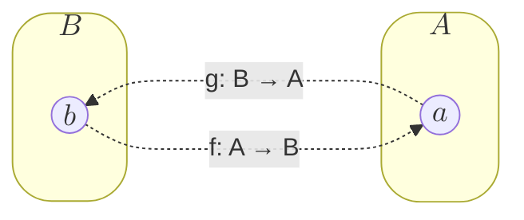

# 4. タプル、構造体、列挙型

この章のテーマはタプル、構造体、列挙型です。簡単に言えば、MoonBitでデータ構造をカスタマイズする方法を探求していきます。

## 復習: タプル

まず、[第2章](./development-environments-expressions)で紹介されたMoonBitの基本データ型であるタプルを復習しましょう。

MoonBitのタプルは、異なる型のデータを固定長で組み合わせた複合データです。一方、リストは同じ型のデータを任意の長さで集めたものです。例えば、以下のリストの長さは固定されていませんが、格納される値はすべて文字型でなければなりません。前章では「Cons」がなぜ「Construct」の略称なのか説明しませんでした。

```moonbit no-check
Cons('H', Cons('i', Cons('!', Nil)))
```

タプルの定義は、括弧で囲まれカンマで区切られた式で表されます。型も同じ構文で指定されます。例えば、個人識別情報の定義は次のようになります: `("Bob", 2023, 10, 24): (String, Int, Int, Int)`。

タプルのメンバには左から`0`始まりのインデックスでアクセスします。例えば、`(2023, 10, 24).0 == 2023`。

## 直積

直積の概念には馴染みがあるかもしれません。2つの集合の直積は、元の2つの集合の要素から形成される順序対をすべて含む集合です。例えば、トランプのスートの集合と1から52までの数字の直積は、スートと数字のすべての可能な順序対を形成します。

$\{♥️ ♦️ ♠️ ♣️\} \times \{ n \in \mathbb{N} \mid 1 \leq n \leq 52 \}$

一方、タプルは2つの集合の直積を超えて、複数の集合の直積を表すため、より正確には順序集合と呼ばれます。したがって、タプルは積型とも呼ばれます。積型と対になる和型があるのか疑問に思うかもしれません。後ほど和型を紹介し、**ゼロ**と**一**の概念についても探求します。

2つの集合の直積を超えて、タプルは複数の集合の直積（n-タプル）を表します。したがって、タプルは積型とも呼ばれます。積型と対になる和型があるのか疑問に思うかもしれません。後ほど和型を紹介し、**ゼロ**と**一**の概念についても探求します。

## 構造体

問題は、タプルで表されるデータを理解するのが難しいことです。例えば、`(String, Int)`は、人の名前と年齢、名前と電話番号、あるいは住所とメールアドレスを表しているのでしょうか？

構造体を使用すると、データ全体の型と各フィールドに個別に**名前**を付けることができます。例えば：

- ```moonbit
  struct PersonalInfo { name: String; age: Int }
  ```

- ```moonbit
  struct ContactInfo { name: String; telephone: Int }
  ```

- ```moonbit
  struct AddressInfo { address: String; postal: Int }
  ```

名前によって、データに関する情報と各フィールドの意味を明確に理解できます。

構造体を定義する構文は`struct <struct_name> { <field_name>: <type> ; ... }`です。例えば: `struct PersonalInfo { name: String; age: Int }`。前述のように、フィールドが別々の行にある場合はセミコロンを省略できます。

構造体の値の定義は中括弧で囲み、各フィールドに値を割り当てます: `<field_name>: <value>`; 各フィールドの割り当ての後にはカンマが続きます。例えば: `let info: PersonalInfo = { name: "Moonbit", age: 1, }`。各値の後のカンマに注意してください。最後のカンマが改行なしで閉じ括弧の直後に続く場合は省略可能です。フィールドの順序は関係ありません。例えば、`{ age: 1, name: "Moonbit" }`。2つの構造体が全く同じフィールドと型を持つ場合、フィールド値だけでは区別が困難です。これを解決するために、`let jack = ({ ... } : PersonInfo)`のように型注釈を追加して値の型を指定します。

構造体のフィールドへのアクセスはタプルと同様で、フィールド名を使用して対応するデータを取得します。例えば、`.age`で`age`フィールドを取得します。既存の構造体に基づいて新しい構造体を作成する場合、各フィールドを再宣言するのは面倒です。特に元の構造体が大きい場合に便利なように、MoonBitでは特定のフィールドのみを更新する機能も提供しています。構造体の値の定義の前に`.. <original_structure>`で基本構造体を示し、変更されたフィールドのみを宣言できます。以下の例を参照してください。

```moonbit no-check
let new_info = { .. old_info, age: 2, }
let other_info = { .. old_info, name: "Hello", }
```

## タプルと構造体の関係

タプルと構造体は非常に似ていることに気付くかもしれません。実際、同じ型で構成された構造体とタプルは同型です。ここでの同型とは、2つの集合間に一対一の対応が存在することを意味します。集合$A$と$B$の間に写像$f: A \to B$と$g: B \to A$が存在し、任意の$a \in A$と$b \in B$に対して$g(f(a)) = a$と$f(g(b)) = b$を満たす場合、これら2つの集合は同型です。以下の図に示すように。



例えば、`PersonalInfo`と`(String, Int)`は同型です。次のような対応関係を確立できます:

```moonbit expr
fn f(info: PersonalInfo) -> (String, Int) { (info.name, info.age) }

fn g(pair: (String, Int)) -> PersonalInfo { { name: pair.0, age: pair.1, }}
```

自由に検証してみてください。同様に、`PersonalInfo`は`(Int, String)`とも同型です。対応する写像を自分で定義してみてください。

タプルと構造体の主な違いは互換性にあります。タプルは*構造的*であり、構造が同じであれば互換性があります。つまり、各フィールドの型が一対一で対応している必要があります。例えば、ここで関数はタプルを正常に受け入れます。

```moonbit
fn accept(tuple: (Int, String)) -> Bool {
  true
}
let accepted: Bool = accept((1, "Yes"))
```

一方、構造体は*名前的*であり、互換性は型名に基づいており、内部の順序は並べ替え可能です。最初の例では、構造体が同一であっても、型名が異なるため関数は構造体を受け入れられません。2番目の例では、フィールドの順序が異なっていても型が同じであれば関数は受け入れられます。

```moonbit no-check
struct A { val : Int ; other: Int }
struct B { val : Int ; other: Int }
fn accept(a: A) -> Bool {
  true
}
let not_accepted: Bool = accept(({ val : 1, other : 2 }: B)) // DO NOT COMPILE
let accepted: Bool = accept(({other: 2, val: 1}: A))
```

## パターンマッチング

パターンマッチングはタプルと構造体にアクセスする別の方法です。

```moonbit
fn head_opt(list: @immut/list.T[Int]) -> Option[Int] {
  match list {
    Nil => None
    Cons(head, tail) => Some(head)
  }
}

fn get_or_else(option_int: Option[Int], default: Int) -> Int {
  match option_int {
    None => default
    Some(value) => value
  }
}
```

以前に`List`と`Option`の構造を検査するためにパターンマッチングを使用しました。例えば、`Nil`と`Cons`でリストをマッチングしたり、`None`と`Some`でOptionをマッチングしたりしました。実際、パターンマッチングは値（ブール値、数値、文字、文字列）だけでなくコンストラクタもマッチングできます。

```moonbit
fn is_zero(i: Int) -> Bool {
  match i {
    0 => true
    1 | 2 | 3 => false
    _ => false
  }
}
```

上記の例では数値をマッチングしました。ここではパイプ記号（`or`パターン）を使用して複数の可能な値を同時にマッチングします。アンダースコア（`_`）は残りのすべてのケースにマッチするワイルドカードです。コンストラクタ内でパターンをネストしたり、対応する構造体を識別子にバインドしたりできます。

```moonbit
fn contains_zero(l: @immut/list.T[Int]) -> Bool {
  match l {
    Nil => false
    Cons(0, _) => true
    Cons(_, tl) => contains_zero(tl)
  }
}
```

この例では、`Cons(0, _)`ブランチは`0`で始まるリストにマッチします。`Cons(_, tl)`ブランチは他のリストにマッチし、サブリストを識別子`tl`にバインドしてさらに処理します。現在のリストの先頭はワイルドカードによって破棄されます。

タプルや構造体のパターンマッチングは、コンストラクタの場合と同様に行います。

```moonbit
fn first(pair: (Int, Int)) -> Int {
  match pair {
    (first, second) => first
  }
}

fn baby_name(info: PersonalInfo) -> Option[String] {
  match info {
    { age: 0, .. } => None
    { name, age } => Some(name)
  }
}
```

タプルのパターンはその定義と同様に、括弧で囲まれカンマで区切られます。マッチ対象のタプルの長さが正しいことを確認してください。構造体のパターンは中括弧で囲まれカンマで区切られます。パターンマッチングをより柔軟にするために、追加のパターン形式があります：

- 特定の値を明示的にマッチ（例：`age: 0`で特定の値を持つデータにマッチ）
- 別の識別子を使用してフィールドをバインド（例：`age: my_age`）。フィールド名を識別子として使用したくない場合に便利です。
- 残りのフィールドを`..`で省略

ネストしたパターンの使用方法を理解するためにもう一つの例を示します。`zip`関数は2つのリストをジッパーのようにペアの新しいリストに結合します。結果のリストの長さは入力リストの最小長になります。リスト`[1, 2, 3]`と`['a', 'b', 'c', 'd']`が与えられた場合、ジップされたリストは`[(1, 'a'), (2, 'b'), (3, 'c')]`になります。

```moonbit
fn zip(l1: @immut/list.T[Int], l2: @immut/list.T[Char]) -> @immut/list.T[(Int, Char)] {
  match (l1, l2) {
    (Cons(hd, tl), Cons(hd2, tl2)) => Cons((hd, hd2), zip(tl, tl2))
    _ => Nil
  }
}
```

パターンマッチングを使用して関数を定義します。ここでは、タプルを構築してペアをマッチし、ネストしたタプルパターンをマッチすることで、両方のリストを同時にマッチしています。入力リストのいずれかが空の場合、結果は空のリストになります。両方のリストが空でない場合、非空の結果が得られます。結果の最初のアイテムは入力から取得した2つの値のタプルで、その後ろに両方のリストのサブリストをジップした結果が続きます。パターンマッチングの順序は上から下であることに注意してください（ワイルドカードが先頭にある場合、後続のパターンはマッチされず、コードは実行されません。MoonBitはこれを検出して警告を出します。これらの警告は助言的なもので、コンパイルを妨げませんが、IDEの問題パネルに注意を払うことが重要です）。

最後に、パターンマッチングは`match`に限定されません。データバインディングでも使用できます。ローカル定義では、パターンマッチング式を使用して対応するサブ構造を識別子にバインドできます。マッチが失敗した場合、プログラムはランタイムエラーで終了することに注意が必要です。

```moonbit no-check
let ok_one = Result::Ok(1);
let Result::Ok(one) = ok_one;
let Result::Err(e) = ok_one; // Runtime error
```

## 列挙型

それでは、列挙型について詳しく見ていきましょう。

考えてみてください、いくつかの可能性の和集合をどのように表現すべきでしょうか？例えば、月曜日から日曜日までの集合を表す型をどのように定義しますか？コイントスの結果（表または裏）を表す型はどうでしょうか？整数演算の結果（成功、オーバーフロー、ゼロ除算など）を表す型は？

答えは列挙型です。列挙型を使用すると、異なるケースを表すデータ構造を定義できます。例えば、ここでは週の7日間の集合とコイントスの結果を定義しています。

```moonbit
enum DaysOfWeek {
  Monday; Tuesday; Wednesday; Thursday; Friday; Saturday; Sunday
}

enum Coin {
  Head
  Tail
}
```

列挙型の構築方法は以下の通りです：

```moonbit no-check
enum <type_name> { <variant>; }
```

ここで、各可能なバリアントはコンストラクタです。例えば、`let monday = Monday`では、`Monday`が月曜日を定義しています。異なる列挙型では、一部のケースで同じ名前を使用する可能性があるため、競合が発生する場合があります。そのような場合、`<型名>::`をコンストラクタの前に追加して区別します（例：`DaysOfWeek::Monday`）。

ここで疑問が生じます。なぜ列挙型が必要なのでしょうか？単に1から7の数字で月曜日から日曜日を表すのではなぜダメなのでしょうか？次の2つの関数を比較してみましょう。

```moonbit no-check
fn tomorrow(today: Int) -> Int
fn tomorrow(today: DaysOfWeek) -> DaysOfWeek
let tuesday = 1 * 2 // Is this Tuesday?
```

最も大きな違いは、列挙型で定義された関数は全関数であるのに対し、整数で定義された関数は部分関数であることです。これにより、ユーザーが不正な入力（例えば`-1`や`8`）を渡す可能性が高まり、コンパイラを通じてこれを防ぐ手段がありません。さらに、曜日に1を加えるとはどういう意味でしょうか？曜日を数値で乗算する意味は？なぜ月曜日を2倍すると火曜日になるのか？火曜日を2で割ると月曜日になるのはなぜか？列挙型は既存の型から自身を区別し、より優れた抽象化を可能にします。

また、列挙型は不合理なデータ表現を防ぎます。例えば各種サービス利用時、ユーザー識別は電話番号またはメールアドレスのいずれかで行えますが、両方ともオプションであり一方のみ必須です。これを2つのnull許容フィールドを持つ構造体で表現すると、両フィールドが空または両方にデータが存在するという望ましくない状態のリスクがあります。列挙型を使用すれば、合理的なデータ範囲をより適切に制限できます。

列挙型の各バリアントはデータを保持することも可能です。例えば`Option`列挙型がその例です。

```moonbit no-check
enum Option[T] {
    Some(T)
    None
}

enum ComputeResult {
    Success(Int)
    Overflow
    DivideByZero
}
```

これを実現するには、各バリアントの後に括弧でパラメータを囲みカンマで区切ります。2番目の例では、整数演算成功ケースを定義し、その値は整数です。列挙型は直和集合に対応します。これはまず異なるケースの集合（例えば`Some`の型`T`が表す集合と`None`の単一値集合）の和集合であり、次に各ケースが一意の名前を持つため区別可能です。たとえ2つのケースが同じデータ型を持っていても、それらは完全に異なります。このため列挙型は和型とも呼ばれます。

### ラベル付き引数

関数と同様に、enumコンストラクタもラベル付き引数の使用をサポートしています。この機能はパターンマッチングパターンを簡素化するのに有益です。例：

```moonbit
enum Side {
  FrenchFries
  Salad
}

enum Drink {
  Coke
  Sprite
  Soup
}

enum Order {
  ChickenThigh(~side : Side, ~drink : Drink)
  KayaToast(~drink : Drink, ~no_kaya : Bool)
}

fn getSoftDrink(order : Order) -> Option[Drink] {
  match order {
    // use `label=pattern` to match labeled arguments of constructor
    ChickenThigh(side=_, drink=Soup) => None
    // `label=label` can be abbreviated as `~label`
    ChickenThigh(side=_, ~drink) => Some(drink)
    // use `..` to ignore all remaining labeled arguments
    KayaToast(drink=Soup, ..) => None
    KayaToast(~drink, ..) => Some(drink)
  }
}

fn init {
  // syntax for creating constructor with labeled arguments is the same as calling labeled function
  let order : Order = ChickenThigh(side=Salad, drink=Coke)
  let _: Option[Drink] = getSoftDrink(order)
}
```

## 代数的データ型

これまでに直積型と和型について言及しました。ここで代数的データ型について簡単に紹介します。この導入は非常に基本的な内容であることに注意してください。より深い理解には参考文献を参照してください。

前述のタプル、構造体、列挙型は総称して代数的データ型と呼ばれます。これらが代数的データ型と呼ばれる理由は、代数的操作（具体的には「和」と「積」）を通じて型を構築し、代数的構造を示すためです。通常の数値における等式、加算、乗算、および任意の数に1を乗じるとその数自身になる、任意の数に0を加えるとその数自身になるなどの性質を思い出してください。同様に、代数的データ型は以下のような性質を示します：

- 型の等価性は同型を意味する
- 型の乗算は直積型（タプルまたは構造体）を形成する
- 型の加算は和型（列挙型）を形成する

ここで、**ゼロ**は**空型**に対応する型です。ケースを持たない空の列挙型を定義できます。この型にはコンストラクタがなく、値を構築できないため空です。**1**は単一の要素のみを持つ型に対応し、これを**ユニット型**と呼び、その値は0タプルです。

前述の性質を検証しましょう：任意の数に$1$を乗じるとその数自身になり、任意の数に$0$を加えるとその数自身になります。

```moonbit no-check
fn f[T](t: T) -> (T, Unit) { (t, ()) }
fn g[T](pair: (T, Unit)) -> T { pair.0 }
```

この文脈では、型`T`に$1$を乗じることは、`(T, Unit)`が`T`と同型であることを意味します。マッピングの集合を確立できます：`T`から`(T, Unit)`へは単に0タプルを追加するだけで簡単に移行できます。逆に、`(T, Unit)`から`T`へは0タプルを無視することで移行できます。これらが同型であることが直感的に理解できるでしょう。

```moonbit
enum Nothing {}

enum PlusZero[T] { CaseT(T); CaseZero(Nothing) }

fn f[T](t: PlusZero[T]) -> T {
  match t {
    CaseT(t) => t
    CaseZero(_) => abort("Impossible case, no such value.")
  }
}

fn g[T](t: T) -> PlusZero[T] { CaseT(t) }
```

任意の型にゼロを加えてもその型自身と等しいという性質は、任意の型に対して、列挙型`PlusZero`を定義することで示せます。この型は`T`型の値を含むケースと`Nothing`型の値を含むケースを持ち、`T`型と同型です。マッピングのセットを構築できます。`PlusZero`から始めて、パターンマッチングでケースを検討します。含まれる値が`T`型の場合、直接`T`にマッピングします。型が`Nothing`の場合、このケースは決して発生しません（`Nothing`型の値は存在しないため）、プログラムを終了させる`abort`で処理します。逆方向では、単に`T`を`CaseT`でラップします。この説明は非常に基本的で直感的な理解を提供するものです。興味があればさらに探求してください。

以下にいくつかの例を示します。

```moonbit
enum Coins { Head; Tail }
```

$\texttt{Coins} = 1 + 1 = 2$

```moonbit no-check
enum DaysOfWeek { Monday; Tuesday; ...; }
```

$\texttt{DaysOfWeek} = 1 + 1 + 1 + 1 + 1 + 1 + 1 = 7$

コイントスのデータ型は$1 + 1$と考えることができます。各ケース（`Head`と`Tail`）は実際には単一の値を持つ集合を表すため、各ケースはUnit型と同型です。和型で結合すると、`Coin`型は$1 + 1 = 2$となり、2つの値を持つ集合を表します。これは2つの値を持つ他の任意の型と同型です。同様に、`DaysOfWeek`は7つの値を持つ集合を表し、7つの値を持つ他の任意の型と同型です。

より興味深い例として`List`、特に`List[Int]`を取り上げます。

`List[Int]`の定義から、整数リストは空リストか、整数とサブリストで構成されるかのいずれかです。空リストはUnit型と同型なので、`1 + Int * List`と表現できます。`List`は再帰的であるため、`1 + Int * 1 + Int * List`と置換できます。乗法の結合則を適用すると、`1 + Int * (1 + Int * List)`を得ます。置換と簡略化を続けると、整数リストの集合は、単一値集合、整数集合、2つの整数集合、さらには整数集合の無限直積の和集合であることがわかります。これは現実と一致します。

## まとめ

この章では、MoonBitにおける様々なカスタムデータ型を探求しました：

- **タプル**: 異なるデータ型の固定長組み合わせ
- **構造体**: フィールドに名前を付けたタプル（理解しやすくするため）
- **列挙型**: 異なるケースやオプションをモデル化するために使われる、明確な値の集合を表す型

また、タプル・構造体・列挙型を含む代数的データ型の概念に触れ、代数に見られる基本的な性質について議論しました。

さらに深く学ぶには、以下を参照してください：

- ***Category Theory for Programmers***: [第6章 - 単純な代数的データ型](https://bartoszmilewski.com/2015/01/13/simple-algebraic-data-types/)